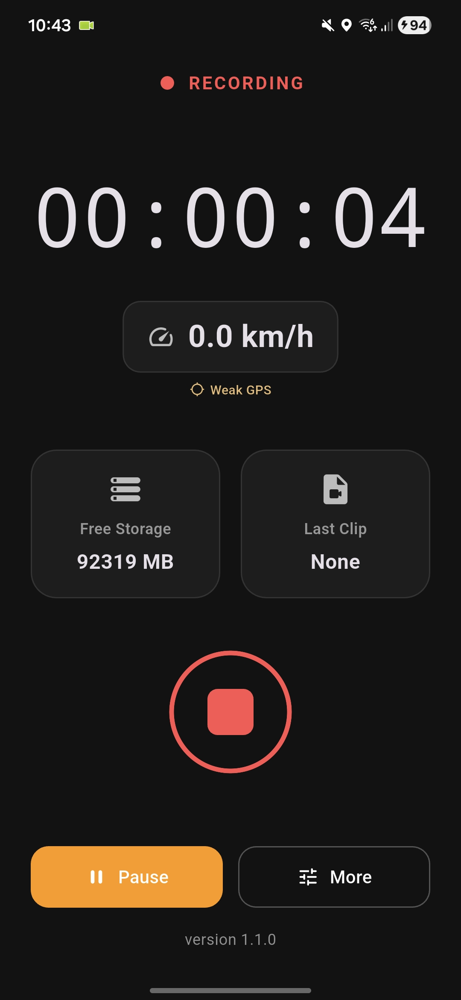
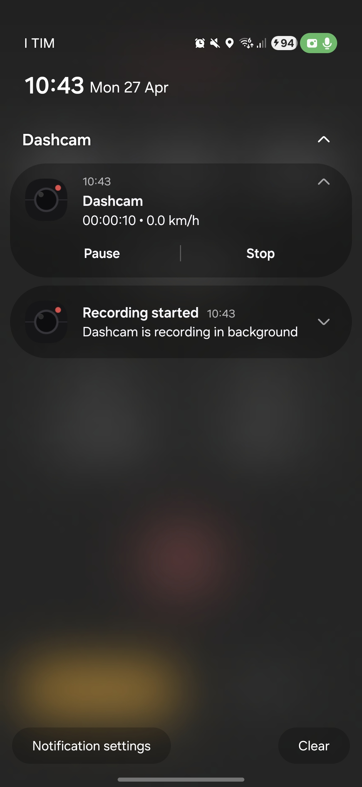

# Dashcam

Dashcam is a Flutter + Android (Kotlin/CameraX) app that turns your phone into a practical in-car dashcam with foreground recording, loop management, and quick controls.

## Current Status

- Platform: Android (primary)
- App version: 1.1.0
- Core stack: Flutter UI + native CameraX foreground service

## Features

- Continuous segmented recording in a foreground service
- Pause, resume, and stop recording (in app and notification controls)
- Quick incident lock for current segment
- Loop cleanup of oldest unlocked clips when space is low
- Live dashboard with:
	- recording timer
	- speed (GPS based)
	- free storage
	- latest clip status
- Low storage alert when remaining space is <= 5 GB
- Recording started notification
- Camera lens toggle (front/rear)

## Notification Controls

Foreground notification provides quick actions without reopening the app:

- Pause / Resume
- Stop
- Timer + current speed shown in notification text

## Battery and Efficiency Notes

Recent optimizations included:

- GPS tracking suspended when app is in background and recording is not active

## Project Structure

- `app/lib/main.dart`: main Flutter UI and app flow
- `app/android/app/src/main/kotlin/com/example/app/MainActivity.kt`: method/event channels
- `app/android/app/src/main/kotlin/com/example/app/DashcamForegroundService.kt`: CameraX recording service
- `app/android/app/src/main/kotlin/com/example/app/DashcamStatusStore.kt`: shared runtime state + alerts

## Getting Started

### Requirements

- Flutter SDK
- Android SDK / Android Studio
- Physical Android device recommended for camera and GPS testing

### Run in debug

```bash
git clone https://github.com/Starry03/dashcam.git
cd dashcam/app
flutter pub get
flutter run
```

### Build APK

```bash
cd app
flutter pub get
flutter build apk
```

## Permissions

The Android app uses:

- Camera
- Microphone
- Fine/coarse location
- Foreground service permissions
- Notifications (Android 13+)

## Preview

<p>
	
	
</p>

## Roadmap

- Improve storage policy settings from UI
- Better analytics and crash diagnostics
- iOS parity where platform constraints allow
